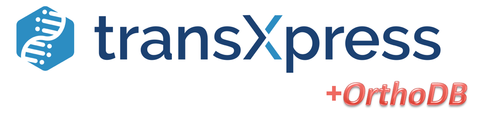
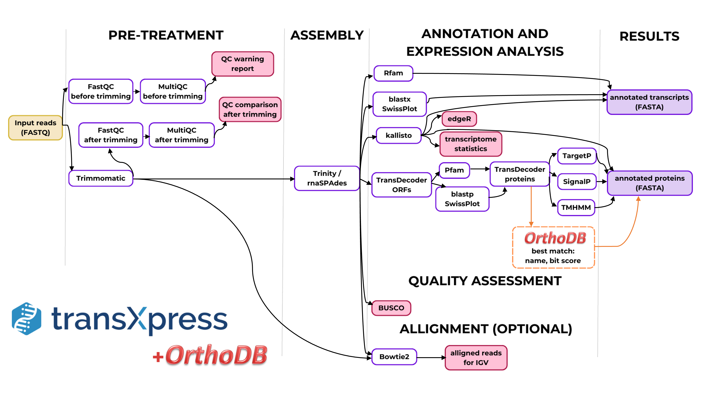
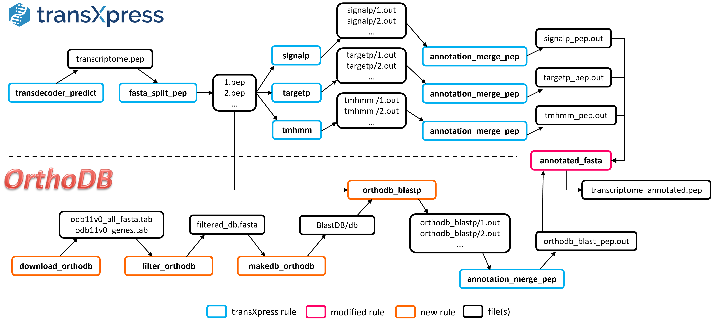

## Intro

In 2023, Fallon et al. introduced transXpress, a streamlined de novo transcriptome assembly and annotation pipeline implemented in Snakemake [1]. While transXpress facilitates the exploration and identification of novel genes and proteins in non-model organisms, it still lacks convenient tools for orthologous gene identification, which is crucial in comparative genomics and evolutionary studies for understanding gene function in non-model organisms [2]. Therefore, our project aims to enhance the transXpress pipeline by integrating data from OrthoDB, the largest hierarchical catalogue of orthologs. This addition will provide annotations about the best matching orthologs from the database, complementing the existing transcriptomes.

## Modifications

We modified the initial pipeline so that each of the annotated proteins in the FASTA file would be complemented with the best matching ortholog name and bit score from OrthoDB (Fig. 1). Bit score is a statistical indicator used to evaluate the BLAST output, that measures sequence similarity independent of query sequence length and database size and is normalised based on the raw pairwise alignment score [3]. Higher bit score indicates better sequence similarity and thus we used this as our main metric to filter out the best match from the database.

In order to connect the existing pipeline to OrthoDB and pull relevant annotations from it, several Snakefile rule changes and additions were required (Fig. 2). Firstly it is necessary to download two .tab files from OrthoDB and unzip them with rule download_orthodb. Further processes can be made faster with filtering out all of the unnamed genes and hypothetical proteins using the rule filter_orthodb. Next the filtered gene data can be inserted into a local BLAST database with the help of a rule makedb_orthodb, in order to make the future BLASTs faster and more efficient. The previous three steps need to be performed only once and the created database can then be used without reloading it in the future. 

The linking of OrthoDB data with the existing transXpress pipeline happens after the fasta_split_pep stage of the initial pipeline that outputs multiple .pep files containing protein data. These files are essential for signalp, targetp, tmhmm and the newly added orthodb_blastp, which all receive identical input and thus produce easily rejoinable output as a result. These four outputs are then edited using the original annotation_merge_pep rule from the transXpress pipeline, which creates four .out files that can be merged with the help of annotated_fasta that required some modifications to also merge the best match annotations from OrthoDB. As a result of this process, each protein in the trancriptome_annotated.pep has additional annotations about the best matching orthologous gene name and its bit score.

## References
1.	R. Stark, M. Grzelak, and J. Hadfield, “RNA sequencing: the teenage years,” Nat Rev Genet, vol. 20, no. 11, Art. no. 11, Nov. 2019, doi: 10.1038/s41576-019-0150-2.T. R. Fallon, T. Čalounová, M. Mokrejš, J.-K. Weng, and T. Pluskal, “transXpress: a Snakemake pipeline for streamlined de novo transcriptome assembly and annotation,” BMC Bioinformatics, vol. 24, no. 1, p. 133, Apr. 2023, doi: 10.1186/s12859-023-05254-8.
2.	A. M. S. Shrestha, J. E. B. Guiao, and K. C. R. Santiago, “Assembly-free rapid differential gene expression analysis in non-model organisms using DNA-protein alignment,” BMC Genomics, vol. 23, no. 1, p. 97, Feb. 2022, doi: 10.1186/s12864-021-08278-7.
3.	R. Avila, “E-values and Bit-scores in BLAST,” 2021. https://ravilabio.info/notes/bioinformatics/e-value-bitscore.html (accessed Jun. 02, 2023).
